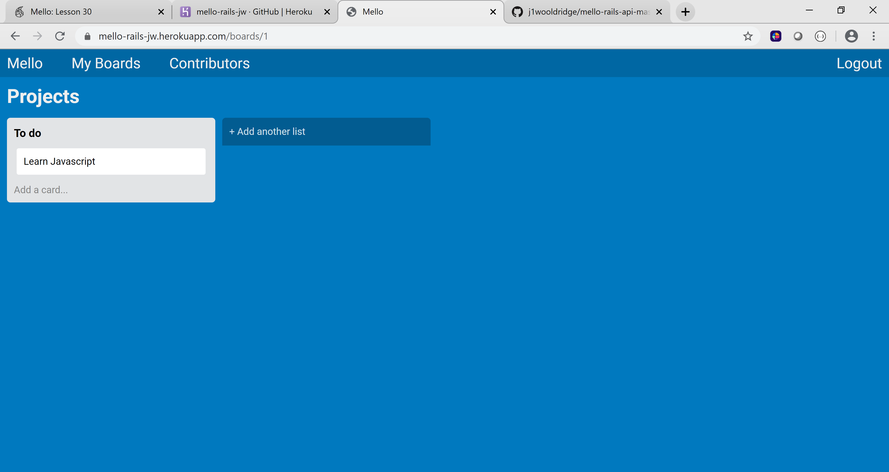

# Mello Full Stack Project

 

Mello is an interactive web app designed after the web-based Kanban-style list-making application called Trello. The project goal was to build a full stack version of the app with jQuery, modals, authentication, and drag and drop functionality.

Deployed Version

Visit https://mello-rails-jw.herokuapp.com to deploy the app.

